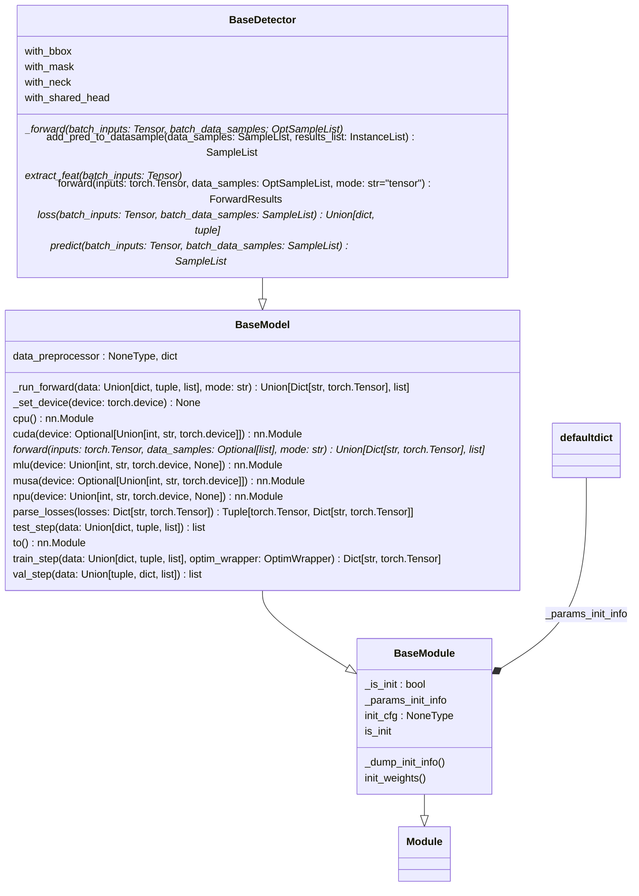
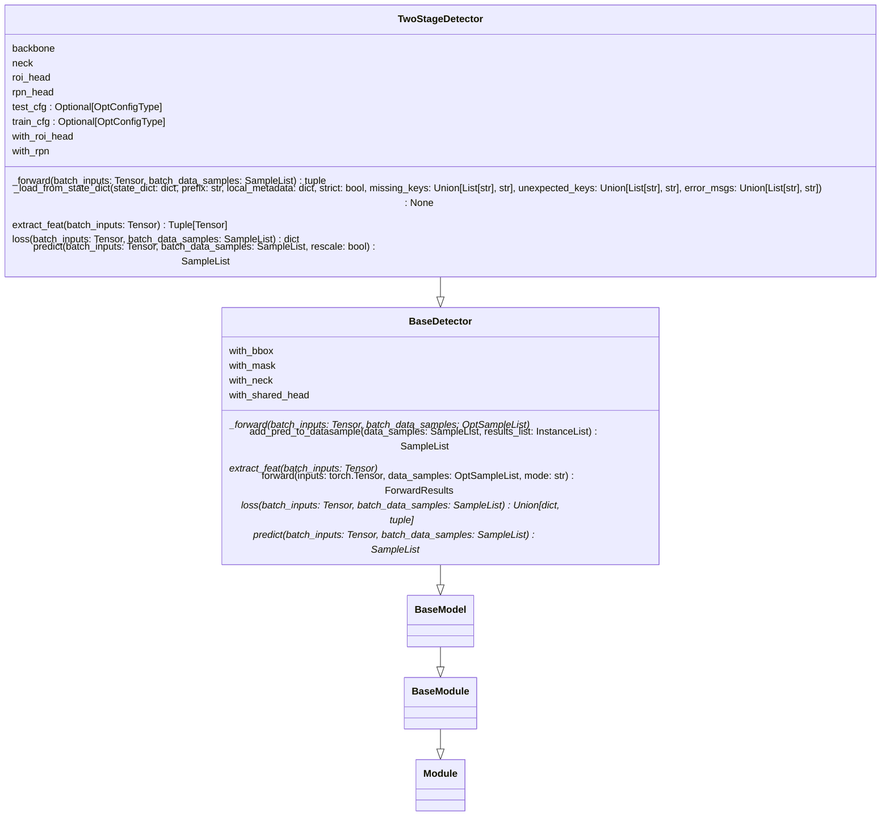

* content
{:toc}
# 写在前面
整理本文的主要目的是因为自己老是记不住，捋不清项目的主要结构，故记下以帮助自己理解和使用时查找。
# mmdet总框架
```
├── apis  
├── core  
│   ├── anchor  
│   ├── bbox  
│   │   ├── assigners  
│   │   ├── coder  
│   │   ├── iou_calculators  
│   │   ├── match_costs  
│   │   └── samplers  
│   ├── evaluation  
│   ├── export  
│   ├── mask  
│   ├── post_processing  
│   ├── utils  
│   └── visualization  
├── datasets  
│   ├── pipelines  
│   └── samplers  
├── models  
│   ├── backbones  
│   ├── dense_heads  
│   ├── detectors  
│   ├── losses  
│   ├── necks  
│   ├── roi_heads  
│   │   ├── bbox_heads  
│   │   ├── mask_heads  
│   │   ├── roi_extractors  
│   │   └── shared_heads  
│   └── utils  
└── utils
```
主要包含被外部调用的**api**、dataset、model、utils和**core**。

其中api的主要目录结构如下：
```
├── __init__.py
├── inference.py
├── test.py
└── train.py
```
包含直接使用`config.py`配置训练，测试推理的代码。

core是整个mmlab的核心组件，包含anchor生成，bbox处理，NMS后处理等其他操作，也包括evaluation，export、visualization等核心功能。

core是整个项目实现的主要调用部分，基本上检测的框架一些专门的部件都抽象，然后封装在里面。这里面东西还挺多的，就分别整理一下。

检测中的一般流程是先抽取特征，然后再在特征上对生成的anchor bbox进行rpn得到第一次粗粒度生成的框proposal，然后对这些proposal进行assigner和sample，再对应到原图上进行bbox_head进行分类和回归，并计算loss。单阶段没有proposal操作直接一步到位对bbox进行操作。

core下的anchor的目录结构如下：
```
├── __init__.py
├── anchor_generator.py
├── builder.py
├── point_generator.py
└── utils.py
```
其中包括普通的anchor_generator和anchor-free的基于point的generator

core下的bbox目录结构如下：
```
├── assigners
│   ├── __init__.py
│   ├── approx_max_iou_assigner.py
│   ├── assign_result.py
│   ├── atss_assigner.py
│   ├── base_assigner.py
│   ├── center_region_assigner.py
│   ├── grid_assigner.py
│   ├── hungarian_assigner.py
│   ├── max_iou_assigner.py
│   ├── point_assigner.py
│   └── region_assigner.py
├── coder
│   ├── __init__.py
│   ├── base_bbox_coder.py
│   ├── bucketing_bbox_coder.py
│   ├── delta_xywh_bbox_coder.py
│   ├── legacy_delta_xywh_bbox_coder.py
│   ├── pseudo_bbox_coder.py
│   ├── tblr_bbox_coder.py
│   └── yolo_bbox_coder.py
├── iou_calculators
│   ├── __init__.py
│   ├── builder.py
│   └── iou2d_calculator.py
├── match_costs
│   ├── __init__.py
│   ├── builder.py
│   └── match_cost.py
├── samplers
│   ├── __init__.py
│   ├── base_sampler.py
│   ├── combined_sampler.py
│   ├── instance_balanced_pos_sampler.py
│   ├── iou_balanced_neg_sampler.py
│   ├── ohem_sampler.py
│   ├── pseudo_sampler.py
│   ├── random_sampler.py
│   ├── sampling_result.py
│   └── score_hlr_sampler.py
├── __init__.py
├── builder.py
├── demodata.py
└── transforms.py
```
包括assigner，sampler，code，iou和match_cost计算模块。


Dataset目录结构
```
├── pipelines
│   ├── __init__.py
│   ├── auto_augment.py
│   ├── compose.py
│   ├── formating.py
│   ├── instaboost.py
│   ├── loading.py
│   ├── test_time_aug.py
│   └── transforms.py
├── samplers
│   ├── __init__.py
│   ├── distributed_sampler.py
│   └── group_sampler.py
├── __init__.py
├── builder.py
├── cityscapes.py
├── coco.py
├── custom.py
├── dataset_wrappers.py
├── deepfashion.py
├── lvis.py
├── utils.py
├── voc.py
├── wider_face.py
└── xml_style.py
```
主要是pipeline，samplers和coco.py(custom.py)值得关注。


model是项目的重中之重，包含backbone, neck, roi_head, dense_head, detector, loss和util
整体结构如下
```
├── models  
│   ├── backbones  
│   ├── dense_heads  
│   ├── detectors  
│   ├── losses  
│   ├── necks  
│   ├── roi_heads  
│   │   ├── bbox_heads  
│   │   ├── mask_heads  
│   │   ├── roi_extractors  
│   │   └── shared_heads  
│   └── utils
```

<details>
<summary>backbones主要目录结构如下 </summary>
<pre><code>
├── __init__.py
├── darknet.py
├── detectors_resnet.py
├── detectors_resnext.py
├── hourglass.py
├── hrnet.py
├── regnet.py
├── res2net.py
├── resnest.py
├── resnet.py
├── resnext.py
├── ssd_vgg.py
└── trident_resnet.py
</code></pre>
</details>

<details>
<summary>neck目录如下</summary>
    <pre><code>
├── __init__.py
├── bfp.py
├── channel_mapper.py
├── fpg.py
├── fpn.py
├── fpn_carafe.py
├── hrfpn.py
├── nas_fpn.py
├── nasfcos_fpn.py
├── pafpn.py
├── rfp.py
└── yolo_neck.py
    </code></pre>
</details>


utils目录如下

```
├── __init__.py
├── collect_env.py
├── contextmanagers.py
├── logger.py
├── profiling.py
├── util_mixins.py
└── util_random.py
```


Registry有哪些：
```
RUNNERS
LOOPS
HOOKS
DATASETS
DATA_SAMOLERS
MODELS
MODEL_RAPPERS
WEIGHT_INITIALIZERS
OPTIMIZERS
OPTIMIZER_WRAPPERS
OPTIMEZER_WRAPPER_CONSTRUCTORS
PARAM_SCHEDULERS
METRICS
EVALUATOR
VISUALIZERS
VISBACKENS
LOG_PROCESSORS
```


调用流程有哪些？
主要是调用`forward`函数, 然后是三种模式`tensor`, `loss`, `predict`. 分别调用方法: `_forward()`, `loss()`, `predict()`. 


关于二阶段检测器的类图
重写了三个方法


