* content
{: toc}

# 如何使用 Mermaid

- 在 HTML 或 Markdown 文件中引用 Mermaid 库和 Mermaid CSS 样式表。
- 使用 Mermaid 的 CLI 工具在命令行中生成图表，或使用 Mermaid 的 API 在自己的应用程序中生成图表。

具体而言，

- 如果只是轻量级、偶尔使用，推荐 Mermaid 在线渲染编辑器——Mermaid Live Editor.
- 推荐使用 Markdown 编辑器，比如 Typora.
- 一些兼容 Markdown 语法，支持 Mermaid Code 的现代编辑器，比如 FlowUs 息流.
- 流程图工具均支持 Mermaid 语法进行程序绘图。比如，VisionOn.
- 更多内容，推荐阅读 [Mermaid 官方文档](httpshttps://mermaid.js.org/intro/)。


# Mermaid 支持哪些类型的图表？

Mermaid 支持多种类型的图表，包括：

- 流程图（Flowchart）：展示过程、决策和操作流程。
- 序列图（Sequence Diagram）：展示对象之间的交互顺序。
- 甘特图（Gantt Chart）：展示项目计划和进度。
- 词云图（Class Diagram）：展示类的结构和关系。
- 饼图（Pie Chart）：展示数据占比。
- 捷径图（Shortcut）：简单展示快捷方式。
- 状态图（State Diagram）：展示对象状态的转换。
- 用户旅程图（Journey）：展示用户如何与应用程序交互。

除此之外，Mermaid 还支持其他类型的图表，例如任务图（Task）和网路拓扑图（Network Topology），以及自定义的图表类型。Mermaid 的语法简单而灵活，可以让用户轻松地创建各种类型的图表。

# Mermaid 语法基础版：快速入门指南

我们可以从创建一些基础的图表类型，学习快速入门。

以下是 Mermaid 语法的快速入门指南，它可以帮助您快速了解如何使用 Mermaid 创建流程图、序列图、甘特图、饼图等常见类型的图表。

## 流程图（Flowchart）

要创建一个简单的流程图，可以使用以下语法：

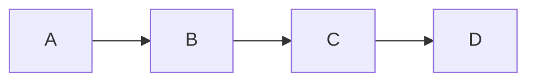

在上面的示例中，graph 关键字用于定义一个图表，LR 参数指定图表方向为从左到右。然后，我们定义了四个形状 A、B、C 和 D，并使用 --> 符号连接它们，表示形状之间的流程顺序。

## 序列图（Sequence Diagram）

要创建一个简单的序列图，可以使用以下语法：

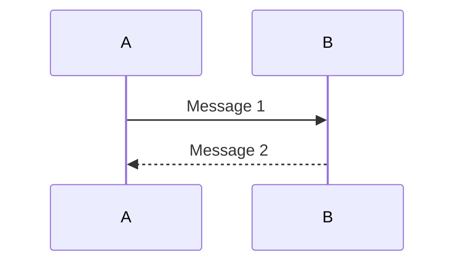
在上面的示例中，sequenceDiagram 关键字用于定义一个序列图。然后，我们定义了两个对象 A 和 B，并使用 ->> 和 -->> 符号连接它们，表示对象之间的消息传递顺序。消息文本可以放在冒号后面。

## 甘特图（Gantt Chart）
要创建一个简单的甘特图，可以使用以下语法：
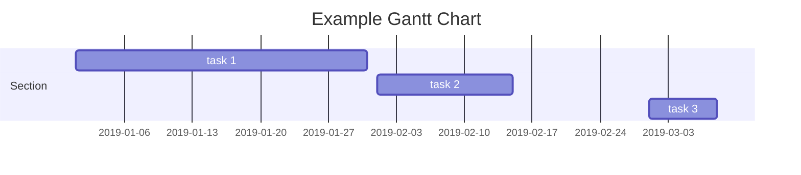
在上面的示例中，gantt 关键字用于定义一个甘特图，title 用于定义图表标题，dateFormat 用于定义日期格式。然后，我们定义了一个部分 Section，并定义了三个任务 task 1、task 2 和 task 3，并指定了它们的开始日期和持续时间。

## 饼图（Pie Chart）
要创建一个简单的饼图，可以使用以下语法：
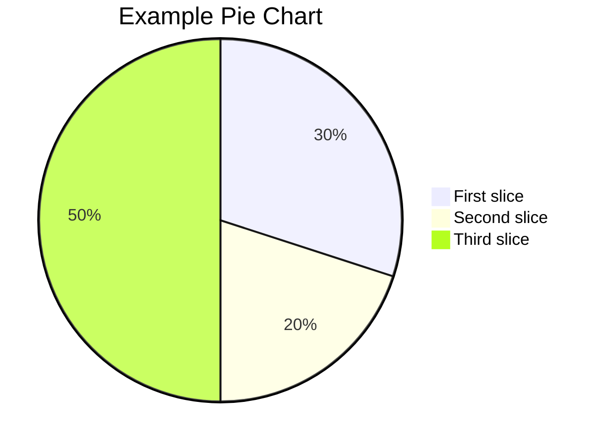
在上面的示例中，pie 关键字用于定义一个饼图，title 用于定义图表标题。然后，我们定义了三个数据点，分别为 "First slice"、"Second slice" 和 "Third slice"，并指定它们的数值。

除此之外，Mermaid 还支持许多其他类型的图表，例如词云图、状态图、用户旅程图等。如果您需要更详细的语法规则和示例，请参考 Mermaid 的官方文档。

# Mermaid 语法高级版：Mermaid 语法有哪些特殊的关键字或符号？

常见的关键字或符号
Mermaid 的语法由一些特殊的关键字和符号组成，用于定义图表的形状、连接和标签。以下是 Mermaid 常用的关键字和符号：

1. graph：定义一个图表。
1. subgraph：定义一个子图表，用于将多个形状分组。
1. pie：定义一个饼图。
1. --> 或 -|>：定义两个形状之间的连接，--> 表示直线连接，-|> 表示垂直连接。
1. --- 或 --：定义形状之间的水平或垂直线条。
1. => 或 ==>：定义形状之间的带箭头的连接线，=> 表示直线箭头，==> 表示双线箭头。
1. class 或 interface：定义一个类或接口形状。
1. participant：定义一个参与者形状。
1. note：定义一个注释形状。
1. title：定义图表标题。
1. style：定义形状的样式。
1. click：定义一个可以单击的形状。
1. loop 或 alt：定义一个循环或条件块。
1. activate 或 deactivate：定义对象的激活或停用状态。
1. subroutine：定义一个子程序。

除此之外，Mermaid 还有一些特殊的关键字和符号，用于定义甘特图、状态图、用户旅程图等特定类型的图表。具体的语法规则可以参考 Mermaid 的文档。

### graph 和 subgraph
下面是一个使用 Mermaid 中的 graph 和 subgraph 关键字创建流程图的示例：

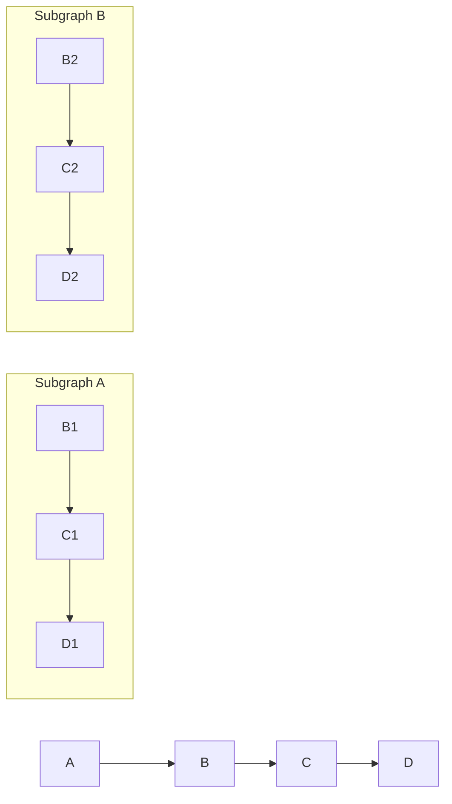

在上面的示例中，我们使用 graph 关键字定义了一个流程图，然后定义了四个形状 A、B、C 和 D，并使用 --> 符号连接它们，表示形状之间的流程顺序。

接下来，我们使用 subgraph 关键字创建了两个子图表 Subgraph A 和 Subgraph B，用于将多个形状分组。在每个子图表中，我们定义了三个形状，并使用 --> 符号连接它们，表示形状之间的流程顺序。

注意，在子图表中定义的形状只能在该子图表中使用，不能在其他子图表或图表中使用。

使用 graph 和 subgraph 关键字可以帮助我们更好地组织和管理复杂的流程图，将相关的形状分组并以更清晰的方式呈现。

### pie
在 Mermaid 中，可以使用 pie 关键字创建饼图。饼图用于表示数据的占比关系，可以通过设置数据的值和标签创建饼图。下面是一个示例代码，演示如何使用 pie 创建饼图：

```mermmad
pie
  title Example Pie Chart
  "Apples" : 45.0
  "Oranges" : 25.0
  "Bananas" : 15.0
  "Grapes" : 10.0
  "Pears" : 5.0
```
在上面的示例中，我们使用 pie 关键字创建了一个饼图，并设置了饼图的标题为 "Example Pie Chart"。然后，我们为饼图添加了五个数据项，分别表示苹果、橙子、香蕉、葡萄和梨的占比，用冒号将数据项的标签和值分隔开。

### 连接类型
在 Mermaid 中，可以使用不同的符号来定义连接的类型。这些符号包括 --> 或 -|>、--- 或 --、=> 或 ==> 等。下面是一些使用示例：

--> 或 -|>：定义从一个节点到另一个节点的直线或垂直线连接。例如：
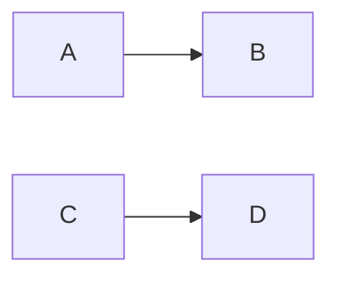
在上面的示例中，我们使用 --> 连接符号定义了从节点 A 到节点 B 的直线连接，使用 -|> 连接符号定义了从节点 C 到节点 D 的垂直连接。

--- 或 --：定义从一个节点到另一个节点的水平线连接。例如：
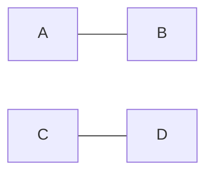
在上面的示例中，我们使用 --- 连接符号定义了从节点 A 到节点 B 的水平连接，使用 -- 连接符号定义了从节点 C 到节点 D 的水平连接。

此外，可以使用--和-<来更改箭头的方向。这里是一些示例：

1. 右箭头：A --> B
1. 左箭头：A <-- B
1. 双向箭头：A <--> B
1. 右箭头带空心三角形：A --▷ B
1. 左箭头带实心三角形：A ◁-- B
1. 双向箭头带空心菱形：A --o B
1. 自我引用带圆形箭头：A ==> A
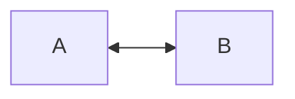
需要注意的是，在使用连接符号时，应该根据具体的业务需求和图表设计选择合适的连接方式和样式，避免连接过于复杂或过于简单影响图表的可读性和美观性。另外，在定义连接时还可以使用 style 关键字为连接设置样式，例如设置连接的颜色和粗细等。

### style
在Mermaid中设置形状的样式和颜色？
在 Mermaid 中，可以使用 style 关键字为形状设置样式和颜色。style 关键字的语法如下：

```
style <shape-id> <style-attr>:<style-value>[;<style-attr>:<style-value>]...
```

其中 <shape-id> 是形状的 ID，<style-attr> 是样式属性，<style-value> 是样式属性的值。可以为形状设置多个样式属性，多个样式属性之间用分号 ; 分隔。

下面是一个示例，演示如何为形状设置样式和颜色：

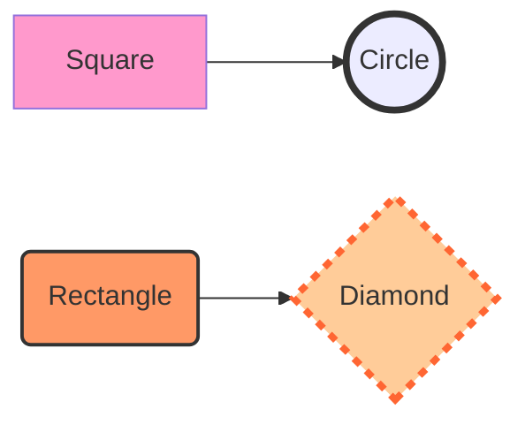

在上面的示例中，我们为四个形状 A、B、C 和 D 设置了不同的样式和颜色。例如，我们使用 fill 样式属性设置形状的填充颜色，使用 stroke 样式属性设置形状的边框颜色，使用 stroke-width 样式属性设置边框宽度，使用 stroke-dasharray 样式属性设置虚线样式等。

除了上述示例中的样式属性，Mermaid 还支持许多其他的样式属性，例如 font-size、font-weight、font-family、text-align、text-decoration 等，可以根据需要进行设置。

使用 style 关键字可以将形状的样式和颜色与具体的业务逻辑和需求相匹配，使图表更加清晰和易于理解。

> 在Mermaid中设置形状的大小？
在 Mermaid 中，可以使用 style 关键字为形状设置大小。要设置形状的大小，可以使用 width 和 height 样式属性。width 样式属性用于设置形状的宽度，height 样式属性用于设置形状的高度。

下面是一个示例，演示如何为形状设置大小：
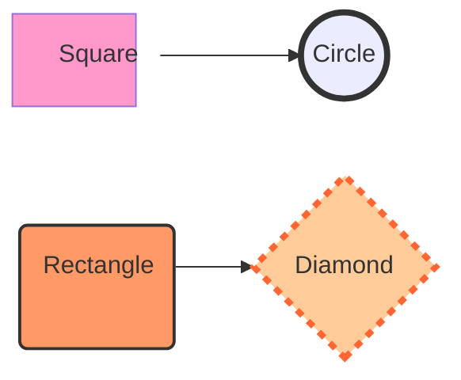
在上面的示例中，我们为四个形状 A、B、C 和 D 设置了不同的大小。例如，我们使用 width 和 height 样式属性对形状的大小进行设置，使它们具有不同的宽度和高度。

需要注意的是，形状的大小可以随需求进行调整，但过大或过小的形状可能会影响图表的可读性和美观性。因此，在设置形状的大小时需要根据具体的业务需求和图表设计进行合理的调整。

### loop 和 alt
在 Mermaid 中，loop 和 alt 是用于定义循环和条件块的关键字，它们有以下的区别：

loop 关键字用于定义一个循环块，它可以让一组形状重复多次。循环块的语法如下：
```mermaid
loop [循环次数]
   [形状 1]
   [形状 2]
   ...
end
```

在上面的语法中，loop 关键字后面可以跟一个可选的循环次数，表示循环的次数。然后，我们可以定义多个形状，它们将在循环块中重复多次。

alt 关键字用于定义一个条件块，它可以根据条件选择不同的路径。条件块的语法如下：
```
alt [条件 1]
   [路径 1]
else if [条件 2]
   [路径 2]
else
   [路径 3]
end
```
在上面的语法中，alt 关键字后面可以跟一个可选的条件，表示条件块的条件。然后，我们可以定义多个路径，表示根据条件选择的不同路径。else if 和 else 是可选的，可以定义多个条件和路径。

因此，loop 和 alt 的主要区别在于它们的用途和语法。loop 用于定义循环块，可以让一组形状重复多次，而 alt 用于定义条件块，可以根据条件选择不同的路径。在使用时，需要根据具体的需求选用合适的关键字和语法。

---

# Mermaid 绘图·分类示范

注释：这篇均是使用 FlowUs 进行 Mermaid 语法的渲染，进行创作。

## Flowchart 流程图
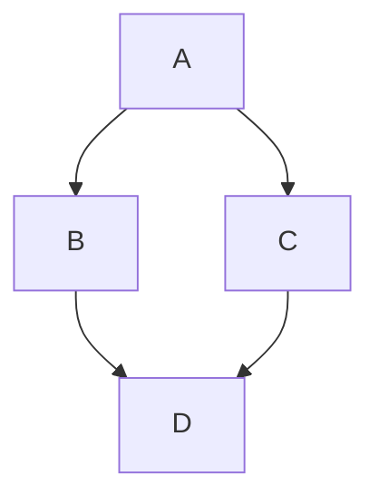

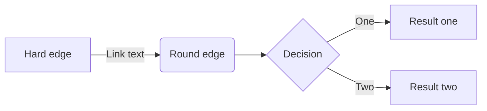

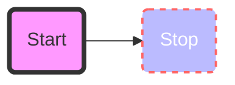


## Sequence diagram

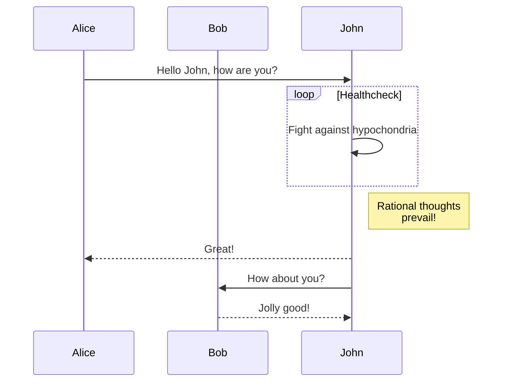

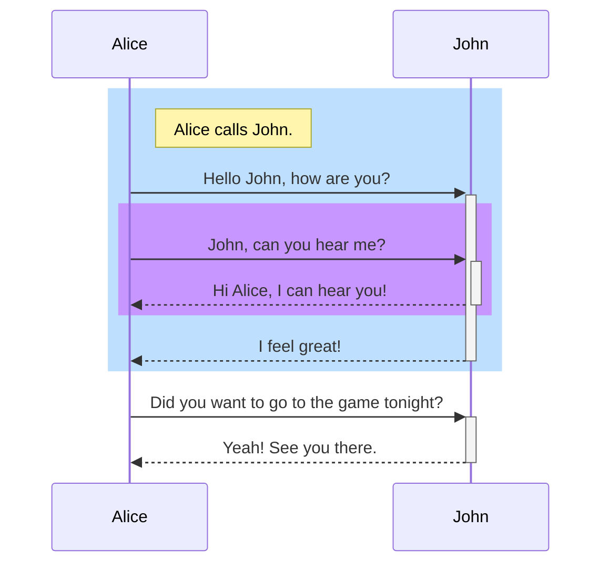


## Class diagram

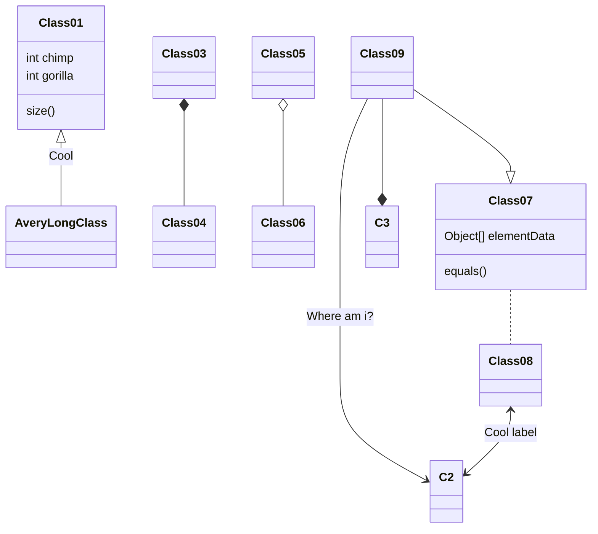

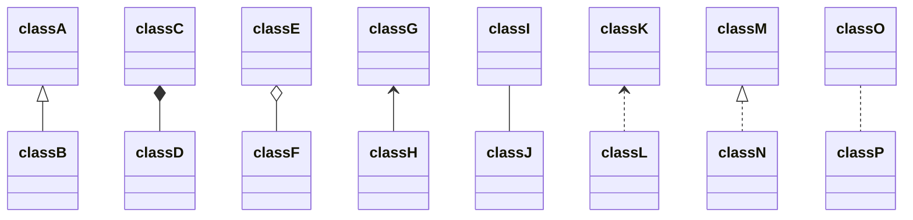

## State Diagram


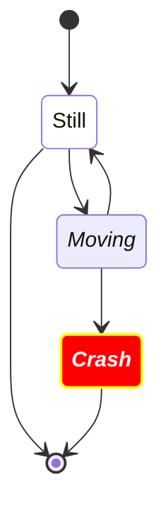

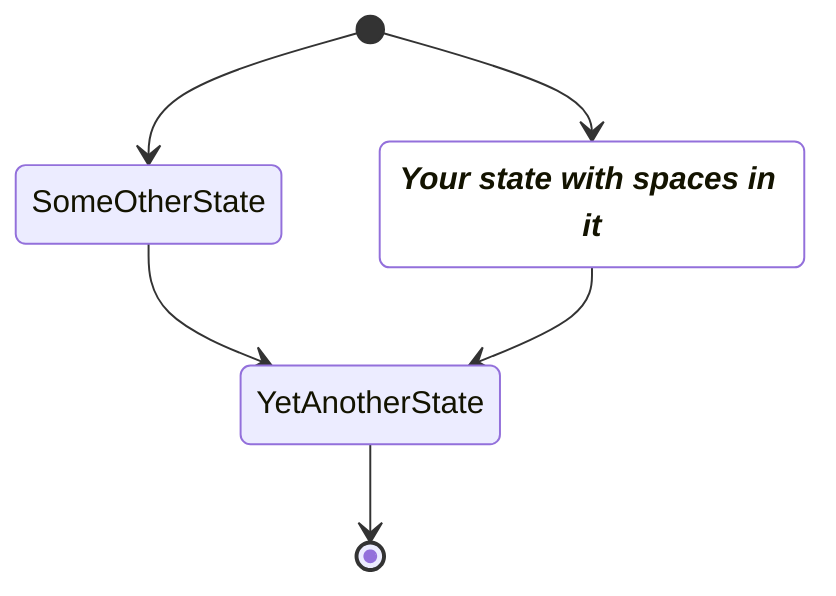


## Entity Relationship Diagram 实体关系图

```mermaid
erDiagram
    CUSTOMER ||--o{ ORDER : places
    ORDER ||--|{ LINE-ITEM : contains
    CUSTOMER }|..|{ DELIVERY-ADDRESS : uses
```

```mermaid
erDiagram
    CAR ||--o{ NAMED-DRIVER : allows
    CAR {
        string registrationNumber PK
        string make
        string model
        string[] parts
    }
    PERSON ||--o{ NAMED-DRIVER : is
    PERSON {
        string driversLicense PK "The license #"
        string(99) firstName "Only 99 characters are allowed"
        string lastName
        string phone UK
        int age
    }
    NAMED-DRIVER {
        string carRegistrationNumber PK, FK
        string driverLicence PK, FK
    }
    MANUFACTURER only one to zero or more CAR : makes
```

```mermaid
User Journey Diagram 用户旅程图
journey
    title My working day
    section Go to work
      Make tea: 5: Me
      Go upstairs: 3: Me
      Do work: 1: Me, Cat
    section Go home
      Go downstairs: 5: Me
      Sit down: 5: Me
```
## Gantt diagram

```mermaid
gantt
dateFormat  YYYY-MM-DD
title Adding GANTT diagram to mermaid
excludes weekdays 2014-01-10

section A section
Completed task            :done,    des1, 2014-01-06,2014-01-08
Active task               :active,  des2, 2014-01-09, 3d
Future task               :         des3, after des2, 5d
Future task2               :         des4, after des3, 5d
```


```mermaid
gantt
    dateFormat  YYYY-MM-DD
    title       Adding GANTT diagram functionality to mermaid
    excludes    weekends
    %% (`excludes` accepts specific dates in YYYY-MM-DD format, days of the week ("sunday") or "weekends", but not the word "weekdays".)

    section A section
    Completed task            :done,    des1, 2014-01-06,2014-01-08
    Active task               :active,  des2, 2014-01-09, 3d
    Future task               :         des3, after des2, 5d
    Future task2              :         des4, after des3, 5d

    section Critical tasks
    Completed task in the critical line :crit, done, 2014-01-06,24h
    Implement parser and jison          :crit, done, after des1, 2d
    Create tests for parser             :crit, active, 3d
    Future task in critical line        :crit, 5d
    Create tests for renderer           :2d
    Add to mermaid                      :1d
    Functionality added                 :milestone, 2014-01-25, 0d

    section Documentation
    Describe gantt syntax               :active, a1, after des1, 3d
    Add gantt diagram to demo page      :after a1  , 20h
    Add another diagram to demo page    :doc1, after a1  , 48h

    section Last section
    Describe gantt syntax               :after doc1, 3d
    Add gantt diagram to demo page      :20h
    Add another diagram to demo page    :48h
```


## Pie chart diagrams


```mermaid
pie title Pets adopted by volunteers
    "Dogs" : 386
    "Cats" : 85
    "Rats" : 15

%%{init: {"pie": {"textPosition": 0.5}, "themeVariables": {"pieOuterStrokeWidth": "5px"}} }%%
pie showData
    title Key elements in Product X
    "Calcium" : 42.96
    "Potassium" : 50.05
    "Magnesium" : 10.01
    "Iron" :  5
```


## Requirement Diagram

```mermaid
requirementDiagram

    requirement test_req {
    id: 1
    text: the test text.
    risk: high
    verifymethod: test
    }

    element test_entity {
    type: simulation
    }

    test_entity - satisfies -> test_req
```


```mermaid
requirementDiagram

    requirement test_req {
    id: 1
    text: the test text.
    risk: high
    verifymethod: test
    }

    functionalRequirement test_req2 {
    id: 1.1
    text: the second test text.
    risk: low
    verifymethod: inspection
    }

    performanceRequirement test_req3 {
    id: 1.2
    text: the third test text.
    risk: medium
    verifymethod: demonstration
    }

    interfaceRequirement test_req4 {
    id: 1.2.1
    text: the fourth test text.
    risk: medium
    verifymethod: analysis
    }

    physicalRequirement test_req5 {
    id: 1.2.2
    text: the fifth test text.
    risk: medium
    verifymethod: analysis
    }

    designConstraint test_req6 {
    id: 1.2.3
    text: the sixth test text.
    risk: medium
    verifymethod: analysis
    }

    element test_entity {
    type: simulation
    }

    element test_entity2 {
    type: word doc
    docRef: reqs/test_entity
    }

    element test_entity3 {
    type: "test suite"
    docRef: github.com/all_the_tests
    }


    test_entity - satisfies -> test_req2
    test_req - traces -> test_req2
    test_req - contains -> test_req3
    test_req3 - contains -> test_req4
    test_req4 - derives -> test_req5
    test_req5 - refines -> test_req6
    test_entity3 - verifies -> test_req5
    test_req <- copies - test_entity2
```

## Git graph

```mermaid
gitGraph
       commit
       commit
       branch develop
       commit
       commit
       commit
       checkout main
       commit
       commit
       merge develop
       commit
       commit

%%{init: { 'logLevel': 'debug', 'theme': 'base', 'gitGraph': {'showBranches': true, 'showCommitLabel':true,'mainBranchName': 'MetroLine1'}} }%%
      gitGraph
        commit id:"NewYork"
        commit id:"Dallas"
        branch MetroLine2
        commit id:"LosAngeles"
        commit id:"Chicago"
        commit id:"Houston"
        branch MetroLine3
        commit id:"Phoenix"
        commit type: HIGHLIGHT id:"Denver"
        commit id:"Boston"
        checkout MetroLine1
        commit id:"Atlanta"
        merge MetroLine3
        commit id:"Miami"
        commit id:"Washington"
        merge MetroLine2 tag:"MY JUNCTION"
        commit id:"Boston"
        commit id:"Detroit"
        commit type:REVERSE id:"SanFrancisco"

%%{init: { 'logLevel': 'debug', 'theme': 'base' } }%%
      gitGraph
        commit
        branch hotfix
        checkout hotfix
        commit
        branch develop
        checkout develop
        commit id:"ash" tag:"abc"
        branch featureB
        checkout featureB
        commit type:HIGHLIGHT
        checkout main
        checkout hotfix
        commit type:NORMAL
        checkout develop
        commit type:REVERSE
        checkout featureB
        commit
        checkout main
        merge hotfix
        checkout featureB
        commit
        checkout develop
        branch featureA
        commit
        checkout develop
        merge hotfix
        checkout featureA
        commit
        checkout featureB
        commit
        checkout develop
        merge featureA
        branch release
        checkout release
        commit
        checkout main
        commit
        checkout release
        merge main
        checkout develop
        merge release
```
## C4 Diagrams


```mermaid
C4Context
      title System Context diagram for Internet Banking System
      Enterprise_Boundary(b0, "BankBoundary0") {
        Person(customerA, "Banking Customer A", "A customer of the bank, with personal bank accounts.")
        Person(customerB, "Banking Customer B")
        Person_Ext(customerC, "Banking Customer C", "desc")

        Person(customerD, "Banking Customer D", "A customer of the bank, <br/> with personal bank accounts.")

        System(SystemAA, "Internet Banking System", "Allows customers to view information about their bank accounts, and make payments.")

        Enterprise_Boundary(b1, "BankBoundary") {

          SystemDb_Ext(SystemE, "Mainframe Banking System", "Stores all of the core banking information about customers, accounts, transactions, etc.")

          System_Boundary(b2, "BankBoundary2") {
            System(SystemA, "Banking System A")
            System(SystemB, "Banking System B", "A system of the bank, with personal bank accounts. next line.")
          }

          System_Ext(SystemC, "E-mail system", "The internal Microsoft Exchange e-mail system.")
          SystemDb(SystemD, "Banking System D Database", "A system of the bank, with personal bank accounts.")

          Boundary(b3, "BankBoundary3", "boundary") {
            SystemQueue(SystemF, "Banking System F Queue", "A system of the bank.")
            SystemQueue_Ext(SystemG, "Banking System G Queue", "A system of the bank, with personal bank accounts.")
          }
        }
      }

      BiRel(customerA, SystemAA, "Uses")
      BiRel(SystemAA, SystemE, "Uses")
      Rel(SystemAA, SystemC, "Sends e-mails", "SMTP")
      Rel(SystemC, customerA, "Sends e-mails to")

      UpdateElementStyle(customerA, $fontColor="red", $bgColor="grey", $borderColor="red")
      UpdateRelStyle(customerA, SystemAA, $textColor="blue", $lineColor="blue", $offsetX="5")
      UpdateRelStyle(SystemAA, SystemE, $textColor="blue", $lineColor="blue", $offsetY="-10")
      UpdateRelStyle(SystemAA, SystemC, $textColor="blue", $lineColor="blue", $offsetY="-40", $offsetX="-50")
      UpdateRelStyle(SystemC, customerA, $textColor="red", $lineColor="red", $offsetX="-50", $offsetY="20")

      UpdateLayoutConfig($c4ShapeInRow="3", $c4BoundaryInRow="1")
```


## Mindmap

```mermaid
mindmap
  root((mindmap))
    Origins
      Long history
      ::icon(fa fa-book)
      Popularisation
        British popular psychology author Tony Buzan
    Research
      On effectiveness<br/>and features
      On Automatic creation
        Uses
            Creative techniques
            Strategic planning
            Argument mapping
    Tools
      Pen and paper
      Mermaid
```


## Timeline Diagram

```mermaid
timeline
    title History of Social Media Platform
    2002 : LinkedIn
    2004 : Facebook : Google
    2005 : Youtube
    2006 : Twitter
```

```mermaid
timeline
        title England's History Timeline
        section Stone Age
          7600 BC : Britain's oldest known house was built in Orkney, Scotland
          6000 BC : Sea levels rise and Britain becomes an island.<br> The people who live here are hunter-gatherers.
        section Broze Age
          2300 BC : People arrive from Europe and settle in Britain. <br>They bring farming and metalworking.
                  : New styles of pottery and ways of burying the dead appear.
          2200 BC : The last major building works are completed at Stonehenge.<br> People now bury their dead in stone circles.
                  : The first metal objects are made in Britain.Some other nice things happen. it is a good time to be alive.
```

最后介绍文章中涉及的几个工具。